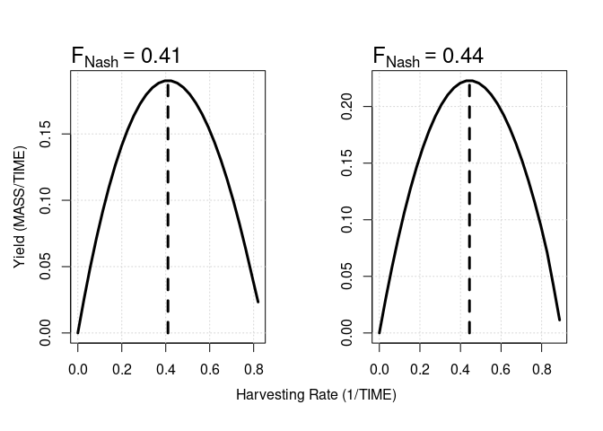

<!-- README.md is generated from README.Rmd. Please edit that file -->

# 

<!-- badges: start -->

[](https://github.com/ThomasDelSantoONeill/nash/actions/workflows/R-CMD-check.yaml)
[](https://cran.r-project.org/web/licenses/GPL-3)
[](https://github.com/ThomasDelSantoONeill/nash)
<!-- badges: end -->

# Quick Start

The goal of `nash` is to compute Nash ([1951](#ref-Nash1951))
Equilibrium (NE) harvesting rates for naturally occurring species that
**biologically interact** through *e.g.* predation and/or competition.
[NE](https://en.wikipedia.org/wiki/Nash_equilibrium) harvesting rates
mean *to exploit each species in a wild mixture at such rates that no
deviation from this rate can increase the long-term yield from that
species* ([Farcas and Rossberg 2016](#ref-Farcas2016)).

The algorithms implemented in `nash` assume that **users have developed
an ecosystem model** with $S$ harvested compartments, typically
represented by population biomass variables. In the **simplest case**,
population dynamics are given by a system of autonomous ordinary
differential equations of the general form:

$$\frac{d\mathbf{B}}{dt}=\mathbf{f}(\mathbf{B})\circ\mathbf{B}-\mathbf{F}\circ\mathbf{B},$$

with $\mathbf{B}$ representing the non-negative biomass or state vector
(dimensions $\text{MASS}$), $\mathbf{f}(\mathbf{B})$ specifying the
population growth (or decay) rate in the absence of exploitation
(dimensions $1/\text{TIME}$) and the last term describing removal
(*e.g.* harvesting and/or culling) at a rate $\mathbf{F}$ (dimensions
$1/\text{TIME}$). In addition, $\circ$ denotes the entry-wise or
[Hadamard](https://en.wikipedia.org/wiki/Hadamard_product_(matrices))
product.

To run `nash`, the user is required to define an `R` function that runs
the above model for given $\mathbf{F}$ values and returns yields at the
stable equilibrium
$\mathbf{Y}=\mathbf{F}\circ\mathbf{B}^*=\mathbf{F}\circ\mathbf{B}^*(\mathbf{F})$.
The `nash` function will then approximate the model near equilibrium via
a multispecies Lotka-Volterra (LV) model, for which the NE can be
computed analytically and so a first estimation of optimal $\mathbf{F}$
obtained. Subsequently, an updated LV approximation is calculated near
the equilibrium given by this new $\mathbf{F}$. `nash` will then
re-compute the NE starting a new iteration until a (user-adjustable)
convergence threshold for $\mathbf{F}$ is reached.

# Installation

You can install the development version of `nash` either through the
`devtools` ([Wickham et al. 2022](#ref-devtools2022)) or `remotes`
([Csárdi et al. 2023](#ref-remotes2023)) packages:

``` r
# install.packages("devtools")
remotes::install_github("ThomasDelSantoONeill/nash")
```

# Minimal Example

The following chunk of code implements a modified two-species
competitive LV model as `HQLV` and showcases the execution of `nash`.
For this example, the `HQLV` function also includes a numerical
integration solver via the `deSolve` package of Soetaert, Petzoldt, and
Setzer ([2010](#ref-deSolve2010)) that returns long-term yields for
given harvesting rates.

``` r
# Load libraries .
library (deSolve) # ODE solver library
library (nash)
# Initial conditions and parameters .
y <- c(b1 = 0.02, b2 = 0.001)
parameters <- c(r1 = 1, r2 = 1,
                a11 = 1, a12 = 0.5,
                a21 = 0.25, a22 = 1)
time <- 1:100
# Numerical fudge to avoid biomasses becoming negative .
inv <- 1e-5
# Model formulation .
HQLV <- function(par, avg.window = 10) {
  derivs <- function(time, y, parameters) {
    with (as.list(c(y, parameters)), {
      db1.dt = b1*(r1-a11*b1-a12*b2^2) - par[1]*b1 + inv
      db2.dt = b2*(r2-a22*b2-a21*b1^2) - par[2]*b2 + inv
      return(list(c(db1.dt, db2.dt)))
      })
  }
  # Default integrator in deSolve
  simulation <- ode(y = y, times = time, func = derivs,
                    parms = c(parameters, par))
  # Yield computation
  yields <- array(dim = c(nrow(simulation), length(par)))
  for(i in 1:nrow(simulation)) {
    yields[i,] <- simulation[i, -1] * par
  }
  return(colMeans(tail(yields, n = avg.window)))
}
# Execution of nash
NE <- nash(par = c(0.2, 0.3), fn = HQLV, progress = FALSE)
# Results
print(NE)
#> $par
#>           [,1]     [,2]
#> [4,] 0.4101201 0.444264
#> 
#> $Bnash
#>           [,1]      [,2]
#> [4,] 0.4639249 0.5019498
#> 
#> $value
#> [1] 0.1902649 0.2229980
#> 
#> $counts
#> [1] 20
#> 
#> $convergence
#> [1] "Nash equilibrium found after  4  iterations."
```

By setting the `yield.curves` argument within the `nash` call equal to
`TRUE`, it is possible to compute the yield curves at the NE to verify
that, indeed, “*no fleet can attain higher yields by changing their
corresponding harvesting rates*”.

 \#
Assistance

If you encounter a bug, please file an issue with a minimal reproducible
example on
[GitHub](https://github.com/ThomasDelSantoONeill/nash/issues). For
questions and other discussions/enhancements please email me at
[t.j.delsantooneill@qmul.ac.uk](t.j.delsantooneill@qmul.ac.uk).

## References

<div id="refs" class="references csl-bib-body hanging-indent">

<div id="ref-remotes2023" class="csl-entry">

Csárdi, Gábor, Jim Hester, Hadley Wickham, Winston Chang, Martin Morgan,
and Dan Tenenbaum. 2023. *Remotes: R Package Installation from Remote
Repositories, Including “GitHub”*.
<https://CRAN.R-project.org/package=remotes>.

</div>

<div id="ref-Farcas2016" class="csl-entry">

Farcas, Adrian, and Axel G. Rossberg. 2016. “Maximum Sustainable Yield
from Interacting Fish Stocks in an Uncertain World: Two Policy Choices
and Underlying Trade-Offs.” *ICES J Mar Sci* 73 (10): 2499–2508.
<https://doi.org/10.1093/icesjms/fsw113>.

</div>

<div id="ref-Nash1951" class="csl-entry">

Nash, John. 1951. “Non-Cooperative Games.” *Annals of Mathematics* 54
(2): 286–95. <https://doi.org/10.2307/1969529>.

</div>

<div id="ref-deSolve2010" class="csl-entry">

Soetaert, Karline, Thomas Petzoldt, and R. Woodrow Setzer. 2010.
“Solving Differential Equations in R: Package deSolve.” *Journal of
Statistical Software* 33 (9): 1–25.
<https://doi.org/10.18637/jss.v033.i09>.

</div>

<div id="ref-devtools2022" class="csl-entry">

Wickham, Hadley, Jim Hester, Winston Chang, and Jennifer Bryan. 2022.
*Devtools: Tools to Make Developing r Packages Easier*.
<https://CRAN.R-project.org/package=devtools>.

</div>

</div>
